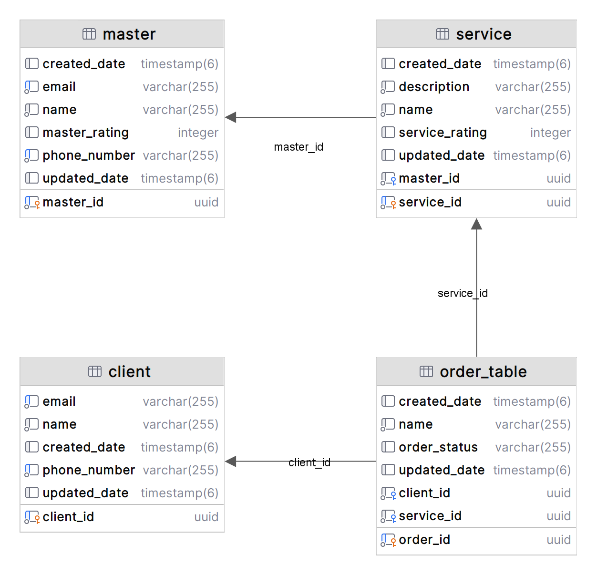

# Beauty Saloon 💇‍♀️

## Description

**Beauty Saloon** is a personal pet project designed as a platform for beauty salon masters to showcase their expertise and services, and for clients to discover and make orders seamlessly.

### Features

- **Masters' Profiles**: Salon masters can create detailed profiles, showcasing their skills, experience, and a portfolio of their work.

- **Service Listings**: Masters can list their services, complete with descriptions, pricing, and availability.

- **Client Accessibility**: Clients can easily browse through a curated selection of salon masters and their offerings.

- **Appointment Booking**: Clients can make orders with their preferred salon masters.

Whether you're a salon professional looking to expand your client base or a client seeking expert beauty services, **Beauty Saloon** is the bridge that connects skilled salon masters with beauty-conscious individuals.

Please note that this project is a personal endeavor, continually evolving and improving. We welcome your feedback and contributions to make **Beauty Saloon** even more delightful for its users.


## Navigation

- [Technology Stack](#technology-stack)
- [REST Endpoints](#rest-endpoints)
- [Database Overview](#database-overview)
- [Getting Started](#getting-started)


## Technology Stack

- **Java**: Version 17

- **Spring Framework**: Version 6 (Spring Boot 3.0.5)

- **Thymeleaf**: A modern server-side Java template engine for both web and standalone environments.

- **PostgreSQL**: The chosen relational database management system.

- **MapStruct**: Used for generating type-safe mapping code to map DTOs to entities and vice versa.

- **ModelMapper**: A flexible, convention-based object mapping library for Java.

- **Maven**: Our build tool of choice, Maven simplifies project management and dependency management. It's responsible for compiling, testing, packaging, and deploying our application, ensuring smooth development and deployment processes.

### Supporting Libraries and Tools

- **Lombok**: A library to reduce boilerplate code in Java classes.

- **Mockito**: A testing framework for Java to create and configure mock objects.

- **Jakarta Validation API**: Provides a mechanism for bean validation.
  
- **Spring Boot Validation**: Provides validation-related features for your Spring Boot application.


## Database Overview

Our Beauty Saloon project employs a PostgreSQL relational database to manage various aspects of our saloon business. We are using PostgreSQL version 15.2. Below is an overview of the key entities in our database, along with their descriptions and relationships.


<div style="text-align:center;">
  
</div>

**Master Entity**
- Description: Stores information about saloon masters, including their contact details and ratings.
- Fields:
  - `master_id` (uuid): A unique identifier for each master.
  - `created_date` (timestamp): The date when the master record was created.
  - `email` (varchar): The email address of the master (Constraints: Not null, Unique, Length 3-50).
  - `name` (varchar): The name of the master (Constraints: Not null, Length 3-50).
  - `master_rating` (integer): The rating of the master.
  - `phone_number` (varchar): The phone number of the master (Constraints: Not null, Unique).
  - `updated_date` (timestamp): The date when the master record was last updated.
- Relationships: 1-to-1 with `service`.

**Client Entity**
- Description: Records data about saloon clients, including their contact details.
- Fields:
  - `client_id` (uuid): A unique identifier for each client.
  - `email` (varchar): The email address of the client (Constraints: Not null, Unique, Length 3-50).
  - `name` (varchar): The name of the client (Constraints: Not null, Length 3-50).
  - `created_date` (timestamp): The date when the client record was created.
  - `phone_number` (varchar): The phone number of the client (Constraints: Not null, Unique).
  - `updated_date` (timestamp): The date when the client record was last updated.
- Relationships: 1-to-1 with `order_table`.

**Service Entity**
- Description: Manages information about saloon services, including descriptions and ratings.
- Fields:
  - `service_id` (uuid): A unique identifier for each service.
  - `created_date` (timestamp): The date when the service record was created.
  - `description` (varchar): A description of the service (Constraints: Not null, Length 3-200).
  - `name` (varchar): The name of the service (Constraints: Not null, Length 3-50).
  - `service_rating` (integer): The rating of the service.
  - `updated_date` (timestamp): The date when the service record was last updated.
  - `master_id` (uuid): The identifier of the master associated with the service.
- Relationships: 1-to-1 with `master`, 1-to-1 with `order_table`.

**Order Entity**
- Description: Tracks saloon orders made by clients, including order status.
- Fields:
  - `order_id` (uuid): A unique identifier for each order.
  - `created_date` (timestamp): The date when the order record was created.
  - `name` (varchar): The name of the order (Constraints: Not null, Length 3-50).
  - `order_status` (varchar): The status of the order.
  - `updated_date` (timestamp): The date when the order record was last updated.
  - `client_id` (uuid): The identifier of the client associated with the order.
  - `service_id` (uuid): The identifier of the service associated with the order.
- Relationships: 1-to-1 with `client`, 1-to-1 with `service`.

## Getting Started

Follow these steps to set up and run the Beauty Saloon project on your local machine.

### Prerequisites

- **Java Development Kit (JDK):** Ensure that you have JDK 17 or a compatible version installed on your system. You can download it from the official Oracle website or use a distribution like OpenJDK.

- **PostgreSQL Database:** You need a PostgreSQL database to run this project. If you don't have PostgreSQL installed, download and install it from the official website: [PostgreSQL Downloads](https://www.postgresql.org/download/).

### Clone the Repository

First, clone the Beauty Saloon repository to your local machine:

```bash
https://github.com/OleksiiDmitriiev/beauty-saloon.git
```

### Database Setup

1. **Create a PostgreSQL Database:**

   Create a new PostgreSQL database for Beauty Saloon. You can do this using the `createdb` command or a PostgreSQL client like pgAdmin.

2. **Restore the Database:**

   Once the database is created, you'll need to restore the database schema and data from an SQL dump file. We've provided a sample SQL dump file (`beauty_saloon_db.sql`) in the project repository.

   Use the following command to restore the database from the SQL dump file:

   ```bash
   psql -U postgres -d beauty_saloon_db -a -f beauty_saloon_db.sql
   ```
